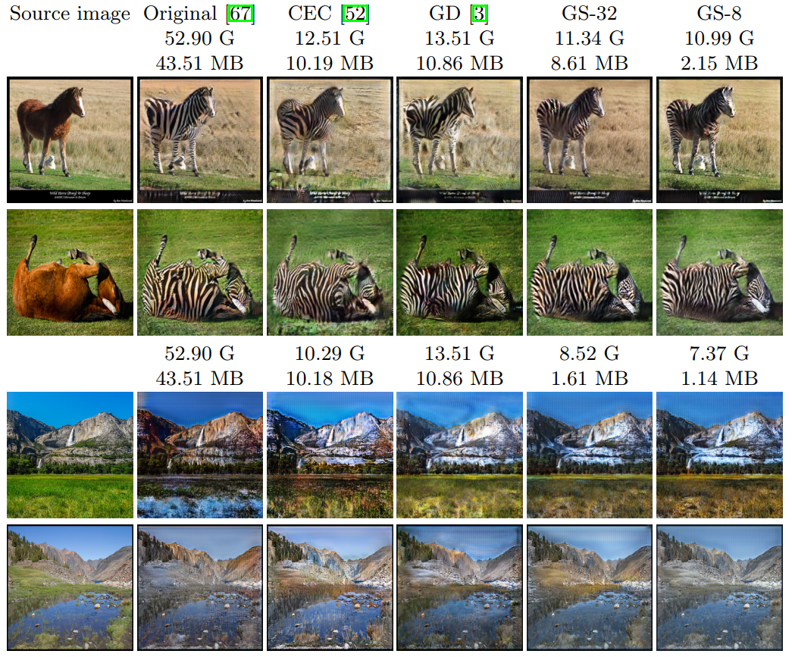

# GAN-Slimming

[](https://opensource.org/licenses/MIT)

[GAN Slimming: All-in-One GAN Compression by A Unified Optimization Framework](https://www.ecva.net/papers/eccv_2020/papers_ECCV/papers/123490052.pdf)

Haotao Wang, Shupeng Gui, Haichuan Yang, Ji Liu, Zhangyang Wang

In ECCV 2020 (Spotlight)

## Overview
An all-in-one GAN compression method integrating model distillation, channel pruning and quantization under GAN minimax optimization framework.

## Visualization Results
Image-to-image translation by (compressed) CycleGAN:


## Training
### 1. Download dataset:
```
./download_dataset <dataset_name>
```
This will download the dataset to folder `datasets/<dataset_name>` (e.g., `datasets/summer2winter_yosemite`).

### 2. Get the original dense CycleGAN:
#### summer2winter_yosemite dataset
Use the [official CycleGAN codes](https://github.com/junyanz/pytorch-CycleGAN-and-pix2pix) to train original dense CycleGAN.

#### horse2zebra dataset
Using the pretrained dense generator and discriminator to initialize G and D for GAN-Slimming is necessary on horse2zebra dataset. Downloaded the dense models for GS32 and GS8 from [here](https://drive.google.com/drive/u/1/folders/10PwGVXBllb5SCfGwIFNUiaQ_bkV-0ROT) and [here](https://drive.google.com/drive/u/1/folders/1uRnbXfFAqrf_eLVBgccIgcnDSlxdHd60) respectively, and put them under the project root path.

### 3. Generate style transfer results on training set
Use the pretrained dense generator to generate style transfer results on training set and put the style transfer results to folder `train_set_result/<dataset_name>`.
For example, `train_set_result/summer2winter_yosemite/B/2009-12-06 06:58:39_fake.png` is the fake winter image transferred from the real summer image `datasets/summer2winter_yosemite/A/2009-12-06 06:58:39.png` using the original dense CycleGAN.

### 4. Compress
GS-32:
```
python gs.py --rho 0.01 --dataset <dataset_name> --task <task_name>
```

GS-8:
```
python gs.py --rho 0.01 --quant --dataset <dataset_name> --task <task_name>
```

The training results (checkpoints, loss curves, etc.) will be saved in `results/<dataset_name>/<task_name>`.
Valid `<dataset_name>`s are: `horse2zebra`, `summer2winter_yosemite`.
Valid `<task_name>`s are: `A2B`, `B2A`. (For example, `horse2zebra/A2B` means transferring horse to zebra and `horse2zebra/B2A` means transferring zebra to horse.)


### 5. Extract compact subnetwork obtained by GS
GAN slimming has pruned some channels in the network by setting the channel-wise mask to zero. Now we need to extract the actual compressed subnetowrk.

```
python extract_subnet.py --dataset <dataset_name> --task <task_name> --model_str <model_str> 
```

The extracted subnetworks will be saved in `subnet_structures/<dataset_name>/<task_name>`

### 6. Finetune subnetwork
```
python finetune.py --dataset <dataset_name> --task <task_name> --base_model_str <base_model_str>
```

Finetune results will be saved in `finetune_results/<dataset_name>/<task_name>`

## Pretrianed Models
Pretrained models are available through [Google Drive](https://drive.google.com/drive/folders/1aBAyuaGX1jxF3lqx1HEzEieX_cXjIapq?usp=sharing).

## Citation
If you use this code for your research, please cite our paper.
```
@inproceedings{wang2020ganslimming,
  title={GAN Slimming: All-in-One GAN Compression by A Unified Optimization Framework},
  author={Wang, Haotao and Gui, Shupeng and Yang, Haichuan and Liu, Ji and Wang, Zhangyang},
  booktitle={European Conference on Computer Vision},
  year={2020}
}
```

## Our Related Work
Please also check our concurrent work on combining neural architecture search (NAS) and model distillation for GAN compression:

Yonggan Fu, Wuyang Chen, Haotao Wang, Haoran Li, Yingyan Lin, and Zhangyang Wang. "AutoGAN-Distiller: Searching to Compress Generative Adversarial Networks." ICML, 2020.
\[[pdf](https://arxiv.org/pdf/2006.08198.pdf)\] \[[code](https://github.com/VITA-Group/AGD)\]